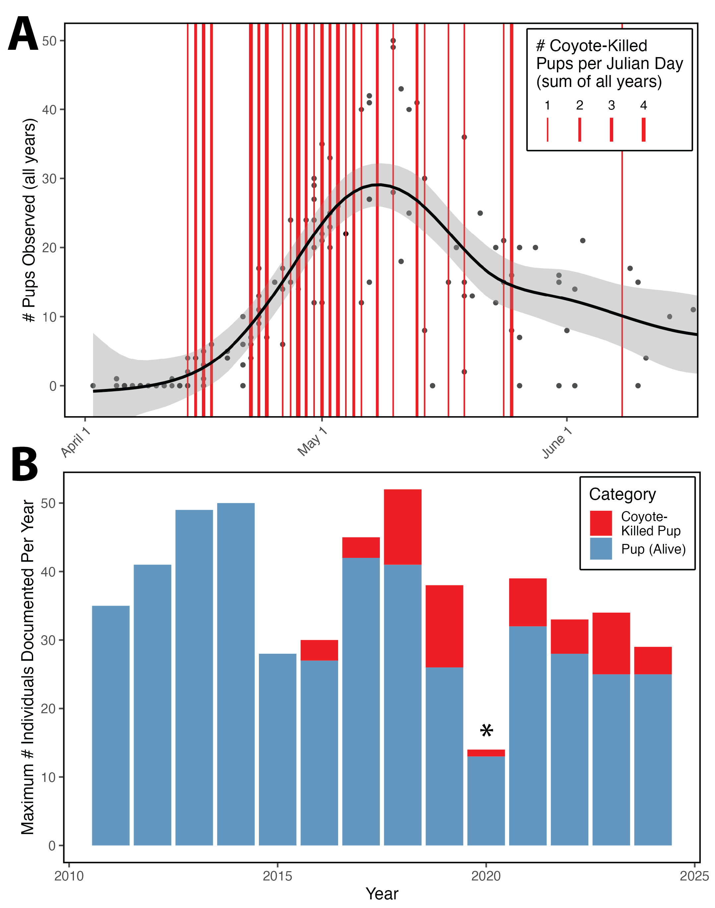

# Coyotes hunt harbor seal pups on the California coast

FD Gerraty, S Grimes, S Pemberton, S Allen, S Codde. (2025) Coyotes hunt harbor seal pups on the California Coast. *Ecology*

This repository contains data and code used to generate Figure 2 in the manuscript "*Coyotes hunt harbor seal pups on the California coast*", in which we describe coyote predation of harbor seal pups at three locations from 2016-2024.

------------------------------------------------------------------------

There is one R script associated with the manuscript, **"Coyote_HASE_Predation_Note.R"**, which imports, cleans, and summarizes raw data and generates two plots that are combined in illustrator to form Figure 2. The script also generates Figure S1.

**Figure 2.** (A) Seasonality of harbor seal pupping and coyote predation at MacKerricher State Beach. Black points represent the total number of pups counted (pooled across 2011-2018), the black line is a generalized additive model fitted to the pup counts, and the red vertical lines represent suspected and confirmed coyote predation events on harbor seal pups. (B) Abundance (maximum annual count during March 1 -- June 30 pupping season) of harbor seal pups and counts of suspected or confirmed coyote predation events at MacKerricher State Beach. \*Rookery monitoring was limited during the 2020 harbor seal pupping season due to COVID-19 restrictions, likely resulting in reduced maximum pup and coyote-killed pup counts.

------------------------------------------------------------------------

## Directory Information + Metadata

#### Folder "[data](https://github.com/fgerraty/Coyote_HASE_Predation_Note/tree/main/data)" houses the following files

-   [**HASE_Predation_Observations.csv**](https://github.com/fgerraty/Coyote_HASE_Predation_Note/blob/main/data/HASE_Predation_Observations.csv) containing raw data outlining all suspected or confirmed coyote predation events.

    Columns

    -   observation_type (either "Confirmed coyote predation" or "Suspected coyote predation")
    -   location (rookery site name)
    -   observation_date
    -   length (harbor seal standard length, cm)
    -   length_actual_estimate (whether seal length was directly measured --- "actual"--- or needed to be estimated due to skull disarticulation from vertebral column --- "estimate")

-   [**MacKerricher_HASE_Counts_Post2018.csv**](https://github.com/fgerraty/Coyote_HASE_Predation_Note/blob/main/data/MacKerricher_HASE_Counts_Post2018.csv) containing raw data from harbor seal population monitoring surveys at MacKerricher State Park from 2009-2018.

    Columns

    -   year
    -   annual_adult_max (maximum count of unique harbor seal adults documented at the MacKerricher rookery in a single survey across all surveys conducted during the April-May pupping season)
    -   annual_pup_max (maximum count of unique harbor seal pups documented at the MacKerricher rookery in a single survey across all surveys conducted during the April-May pupping season)

-   [**MacKerricher_HASE_Counts_Pre2018.csv**](https://github.com/fgerraty/Coyote_HASE_Predation_Note/blob/main/data/MacKerricher_HASE_Counts_Pre2018.csv) containing raw data from harbor seal population monitoring surveys at MacKerricher State Park from 2009-2018.

    Columns

    -   Date
    -   Time
    -   Duration (hours)
    -   Adult (minimum number of unique harbor seal adults counted during survey)
    -   Pup (minimum number of unique harbor seal pups counted during survey)

#### Folder "[output](https://github.com/fgerraty/Coyote_HASE_Predation_Note/tree/main/output)" houses the following files

-   **Figure_1.png**

-   **Figure_2.png** (seasonality_plot.png and annual_summary.png annotated and combined in Illustrator)

-   **Figure_3.png**

-   **Figure_S1.png** (overall_abundance.png annotated in Illustrator)

-   **seasonality_plot.png** (Figure 2A)

-   **annual_summary.png** (Figure 2B)

-   **overall_abundance.png** (Figure S1)

#### Folder "[scripts](https://github.com/fgerraty/Coyote_HASE_Predation_Note/tree/main/scripts)" houses the following file

-   **Coyote_HASE_Predation_Note.R** is the only R script associated with the repository. This script imports, cleans, and manipulates all data files and produces **seasonality_plot.png** and **annual_summary.png** in the "output" folder.
